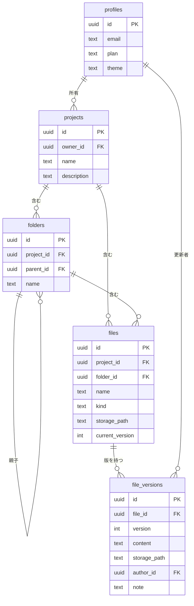

# TaskMatrix

> ドキュメント（フォルダ）を中心に、AI がタスク抽出とスケジュール自動生成を行う
> Apple エコシステム最適化型プロジェクト管理ツール。


---

## 目次

- [概要](#概要)
- [技術スタック](#技術スタック)
- [主要機能と実装状況](#主要機能と実装状況)
- [アーキテクチャ](#アーキテクチャ)
- [データベース構成](#データベース構成)
- [画面一覧](#画面一覧)
- [セットアップ](#セットアップ)
- [開発コマンド](#開発コマンド)
- [開発ルールとドキュメント](#開発ルールとドキュメント)
- [ロードマップ](#ロードマップ)

---

## 概要

TaskMatrix は、プロジェクトのドキュメントを一箇所に集約し、そこから
**タスクの抽出**と**スケジュールの自動算出**までを一貫して行うことを目指した
Web アプリケーションです。

- **ドキュメント中心**: フォルダ階層でファイルを整理し、更新履歴を保持する
- **AI による解析**: ドキュメントからタスクを抽出し、不明瞭な記述を指摘する（第2フェーズ）
- **根拠のあるスケジュール**: AI が算出理由を併記した日程案を提示する（第3フェーズ）
- **Apple エコシステム最適化**: PWA と iOS ショートカットでの利用を想定（第4フェーズ）

---

## 技術スタック

| 区分 | テクノロジー / サービス | 採用理由・役割 |
| --- | --- | --- |
| フロントエンド | Next.js 16（App Router）/ React 19 / TypeScript / PWA | Vercel と親和性が高く、レスポンシブ・PWA 対応 |
| バックエンド / DB | Supabase（PostgreSQL / Auth / Storage） | 認証、データ独立、ファイル実体管理、メタデータ管理 |
| AI エンジン | Google AI Studio（Gemini API） | 高度なテキスト・ドキュメント解析（RAG 実装） |
| デプロイ | Vercel | API 統合・CI/CD |
| コード管理 | GitHub | ソースコードおよびアプリ内テキスト / Markdown の履歴管理 |
| 対象環境 | macOS / iOS / iPadOS / watchOS（PWA・ショートカット） | Apple 端末でのシームレスな利用 |

---

## 主要機能と実装状況

凡例: ✅ 実装済み ／ 🚧 未実装（後続フェーズ）

### ① フォルダ・ドキュメント管理 ✅

- 対応フォーマット: Excel（`.xlsx`）／ Word（`.docx`）／ PowerPoint（`.pptx`）／
  テキスト（`.txt` `.md`）／ PDF（`.pdf`）
- ファイルサイズ上限 25 MB、非公開バケットへ保存し署名付き URL でのみ配信
- アプリ内簡易 Markdown エディタ（編集とプレビューを左右に並べて表示、GFM 対応）
- バージョン履歴と行単位の差分表示（誰がいつ更新したかを保持）

### ② AI タスク抽出・改善提案（Gemini API） 🚧

- **解析・抽出**: 指定フォルダ／ドキュメントを読み込み、タスクを自動リスト化
- **品質向上**: 不透明な記述の指摘、タスク化に向けた具体的な改善・修正案の提示
- **手動調整**: 自動抽出されたタスクの手動追加・編集・削除

### ③ スケジュール自動算出 🚧

- **算出**: タスクの負荷・期限に基づき、AI が最適なスケジュール仮案を出力
- **根拠の明記**: 「なぜその日時に割り当てたか」を提案時に併記
- **確定ワークフロー**: 仮データ表示 → ユーザーの「確定」操作でカレンダーへ反映
- **連携**: Google Calendar 同期、Apple カレンダー用 `.ics` 書き出し

### ④ コンテキスト重視 AI アシスタント（RAG チャット） 🚧

プロジェクト内のファイルを横断検索し、「〇〇の進捗はどう？」などの質疑応答に対応。

### ⑤ エコシステム拡張 🚧

iOS ショートカット / Webhook API を通じた、音声やショートカット経由での
タスク追加・本日の予定参照。

### ⑥ プラットフォーム適応 UI ✅

コンポーネントは 1 セットのまま、デザイントークン（角丸・影・フォント・
アニメーション・配色）を **Apple 風 / Windows 風**で切り替えます。
初回は User-Agent で自動判定し、設定画面から手動で上書きできます。
ライト / ダークは独立した軸として両テーマに対応します。

---

## アーキテクチャ

読み取りは Server Components、書き込みは Server Actions で行います。
Supabase のキーがクライアントバンドルに載らず、全テーブルで RLS が有効です。

```
app/
  (auth)/login, (auth)/signup            認証画面
  (app)/dashboard                        ホーム
  (app)/projects                         プロジェクト一覧
  (app)/projects/[projectId]             フォルダ / ファイル一覧
  (app)/projects/[projectId]/files/[fileId]          ビューア / Markdown エディタ
  (app)/projects/[projectId]/files/[fileId]/history  バージョン履歴・差分
  (app)/settings                         テーマ設定
lib/
  domain/        純粋ロジック（検証・パス生成・差分・上限判定）※単体テストの中心
  usecases/      リポジトリを引数で受け取るユースケース
  repositories/  データアクセス（インターフェース + Supabase 実装）
  actions/       Server Actions
  supabase/      クライアント生成（server / browser / proxy）
  platform/      プラットフォーム判定とテーマ解決
components/ui/   デザイントークン駆動のプリミティブ
components/app/  画面固有コンポーネント
proxy.ts         セッション更新とルート保護（Next.js 16 で middleware から改称）
```

### データ保持戦略

| 種別 | 保存先 |
| --- | --- |
| ファイル実体（Word / Excel / PowerPoint / PDF） | Supabase Storage（非公開バケット `project-files`） |
| テキスト・Markdown の本文と更新履歴 | Supabase DB（`file_versions` に全文スナップショット） |
| カレンダー同期（第3フェーズ） | Google Calendar API / `.ics` 入出力 |
| watchOS 対応（第4フェーズ） | PWA（Web Push）および iOS ショートカット |

---

## データベース構成



第2フェーズ以降で `tasks`（タスク名・抽出元ファイル・ステータス・優先度・期限・
不透明点メモ・AI 改善提案）と `schedules`（カレンダーイベント・開始/終了日時・
算出理由）を追加します。

### アクセス制御

全テーブルで RLS を有効化し、`projects.owner_id = auth.uid()` を起点に
フォルダ・ファイル・バージョン・Storage 実体まで所有者のみに限定しています。

---

## 画面一覧

| 画面 | パス | 状態 |
| --- | --- | --- |
| ログイン / 新規登録 | `/login` `/signup` | ✅ |
| ホーム（ダッシュボード） | `/dashboard` | ✅ |
| プロジェクト一覧 | `/projects` | ✅ |
| プロジェクト詳細 / フォルダ一覧 | `/projects/[projectId]` | ✅ |
| データ閲覧・編集（Markdown エディタ） | `/projects/[projectId]/files/[fileId]` | ✅ |
| 変更履歴・差分 | `/projects/[projectId]/files/[fileId]/history` | ✅ |
| 設定（表示テーマ） | `/settings` | ✅ |
| タスク管理 | `/tasks` | 🚧 |
| スケジュール | `/schedule` | 🚧 |
| プロジェクト横断 AI チャット | `/chat` | 🚧 |

---

## セットアップ

### 前提

- Node.js 20 以上
- Supabase プロジェクト（PostgreSQL / Auth / Storage）

### 1. 依存関係のインストール

```bash
npm install
```

### 2. 環境変数の設定

`.env.local.example` をコピーして `.env.local` を作成し、
Supabase の値を記入します。`.env.local` はコミットしないでください。

```bash
cp .env.local.example .env.local
```

| 変数 | 用途 | 公開範囲 |
| --- | --- | --- |
| `NEXT_PUBLIC_SUPABASE_URL` | Supabase プロジェクト URL | クライアント可 |
| `NEXT_PUBLIC_SUPABASE_ANON_KEY` | 匿名キー（RLS 前提） | クライアント可 |
| `SUPABASE_SERVICE_ROLE_KEY` | 管理操作用（第1フェーズでは未使用） | **サーバー専用** |

### 3. データベースの初期化

`supabase/migrations/` の SQL を番号順に適用します。
Supabase ダッシュボードの SQL Editor、または Supabase CLI を使用してください。

```bash
supabase db push
```

### 4. 開発サーバーの起動

```bash
npm run dev
```

`http://localhost:3000` を開き、`/signup` からアカウントを作成します。

> **メール確認について**
> Supabase はデフォルトでメール確認が有効です。ローカル開発では
> Authentication → Providers → Email の「Confirm email」を
> 無効化しておくと検証が容易になります。

---

## 開発コマンド

| コマンド | 内容 |
| --- | --- |
| `npm run dev` | 開発サーバーを起動 |
| `npm run build` | 本番ビルド |
| `npm start` | 本番サーバーを起動 |
| `npm run lint` | ESLint による静的検査 |
| `npm run typecheck` | ルート型生成 + `tsc --noEmit` |
| `npm test` | Vitest によるテスト実行 |
| `npm run test:watch` | テストの監視実行 |

コミット前に `lint` → `typecheck` → `test` → `build` をすべて通してください。

---

## 開発ルールとドキュメント

本リポジトリでの作業規則は [`CLAUDE.md`](./CLAUDE.md) に定義しています。
主な内容は、機能ごとのブランチ運用、テスト駆動開発、
検証がグリーンでない状態でのコミット禁止、秘密情報の取り扱いです。

| ドキュメント | 内容 |
| --- | --- |
| [`CLAUDE.md`](./CLAUDE.md) | 開発時の動作規則 |
| [`docs/specs/`](./docs/specs) | 設計書 |
| [`docs/plans/`](./docs/plans) | 実装計画 |
| [`supabase/migrations/`](./supabase/migrations) | データベースマイグレーション |

---

## ロードマップ

| フェーズ | 内容 | 状態 |
| --- | --- | --- |
| **P1 基盤** | 認証 / プロジェクト / フォルダ・ファイル / Markdown エディタ / バージョン履歴 / ダッシュボード / プラットフォームテーマ | ✅ 完了 |
| **P2 AI** | Gemini によるタスク抽出・改善提案、タスク管理画面 | 🚧 予定 |
| **P3 スケジュール** | AI 日程算出、カレンダー UI、Google Calendar 同期 / `.ics` 入出力 | 🚧 予定 |
| **P4 拡張** | RAG チャット、PWA 完全対応、iOS ショートカット / Webhook API、GitHub 履歴連携 | 🚧 予定 |
